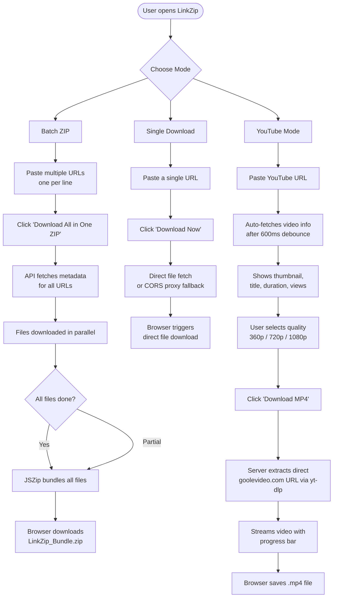
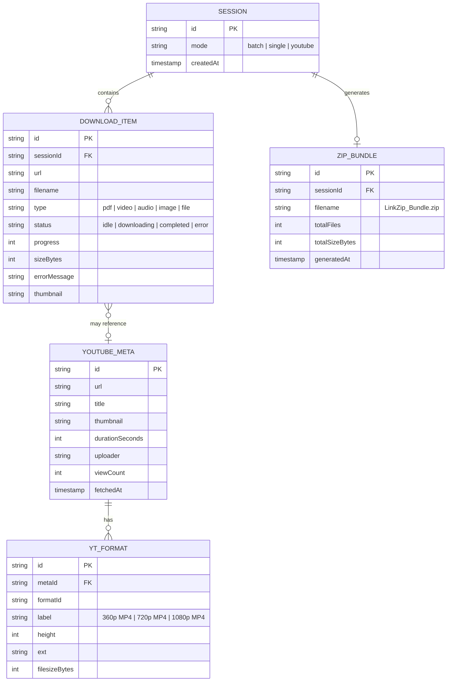
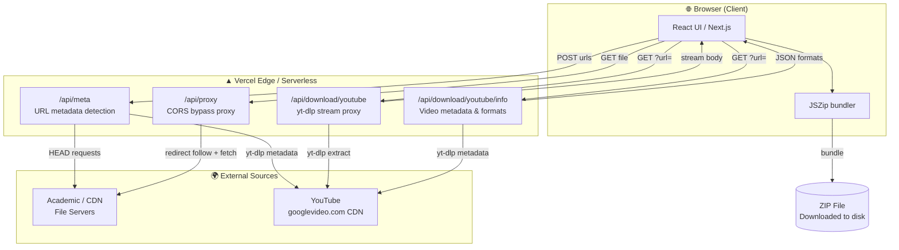

# LinkZip Pro

**Universal Bulk Downloader & ZIP Bundler**

> Paste a list of URLs — YouTube videos, PDFs, images, documents — and download everything as a single high-speed ZIP archive. No account required. Runs entirely in the browser.

🔗 **Live:** [linkzip-saas.vercel.app](https://linkzip-saas.vercel.app)  
🐙 **GitHub:** [github.com/drdhavaltrivedi/linkzip-saas](https://github.com/drdhavaltrivedi/linkzip-saas)

---

## ✨ Features

| Feature | Description |
|---------|-------------|
| **Batch ZIP** | Paste up to 100 links, get one ZIP file |
| **Single Download** | Download any direct file or YouTube video instantly |
| **YouTube Mode** | Dedicated tab with video preview, quality selector, and progress bar |
| **Format Selection** | Choose 360p / 720p / 1080p before downloading |
| **CORS Bypass** | Server-side proxy for cross-origin restricted files |
| **Parallel Downloads** | All files downloaded simultaneously, not sequentially |
| **Error Recovery** | Failed files shown clearly; ZIP still generated for successful ones |
| **PWA Ready** | Installable as a desktop/mobile app |

---

## 🧭 User Flow



---

## 🗄️ Entity Relationship Diagram



---

## 🏗️ System Architecture



---

## 📁 Project Structure

```
linkzip-web/
├── src/
│   └── app/
│       ├── page.tsx                        # Main UI (Batch, Single, YouTube modes)
│       ├── layout.tsx                      # SEO metadata, JSON-LD, fonts
│       ├── globals.css                     # Dark-mode design system
│       ├── sitemap.ts                      # Auto-generated sitemap
│       ├── robots.ts                       # AI + search bot rules
│       └── api/
│           ├── meta/route.ts               # URL metadata detection
│           ├── proxy/route.ts              # CORS bypass proxy
│           └── download/
│               └── youtube/
│                   ├── route.ts            # yt-dlp stream (with format param)
│                   └── info/route.ts       # Video info + quality formats
├── public/
│   ├── logo.png                            # Brand logo / favicon
│   ├── icon.png                            # App icon
│   ├── manifest.json                       # PWA manifest
│   └── llms.txt                            # AI discovery file
├── package.json
└── README.md
```

---

## 🔌 API Reference

### `POST /api/meta`
Fetches metadata (filename, type, thumbnail) for an array of URLs.

**Request**
```json
{ "urls": ["https://example.com/paper.pdf", "https://youtube.com/watch?v=..."] }
```

**Response**
```json
{
  "results": [
    { "url": "...", "filename": "paper.pdf", "success": true, "type": "pdf" },
    { "url": "...", "filename": "My Video.mp4", "success": true, "type": "video", "thumbnail": "..." }
  ]
}
```

---

### `GET /api/proxy?url=<encoded>`
Server-side proxy that fetches external files and returns their binary content, bypassing browser CORS restrictions.

---

### `GET /api/download/youtube?url=<encoded>&format=<formatId>`
Extracts the direct stream URL via `yt-dlp` and proxies the video bytes. Returns `video/mp4` with `Content-Disposition`.

| Param | Required | Description |
|-------|----------|-------------|
| `url` | ✅ | Full YouTube URL |
| `format` | ❌ | Format ID from `/info` endpoint (e.g. `137`) |

---

### `GET /api/download/youtube/info?url=<encoded>`
Returns video metadata and available download quality formats.

**Response**
```json
{
  "title": "My Video",
  "thumbnail": "https://...",
  "duration": 312,
  "uploader": "Channel Name",
  "viewCount": 1200000,
  "formats": [
    { "formatId": "137", "label": "1080p MP4", "height": 1080, "ext": "mp4", "filesize": 52428800 },
    { "formatId": "22",  "label": "720p MP4",  "height": 720,  "ext": "mp4", "filesize": null }
  ]
}
```

---

## 🚀 Local Development

```bash
git clone https://github.com/drdhavaltrivedi/linkzip-saas.git
cd linkzip-saas/linkzip-web
npm install
npm run dev
```

Open [http://localhost:3000](http://localhost:3000)

---

## 🛠️ Stack

| Layer | Technology |
|-------|-----------|
| Framework | Next.js 16 (App Router) |
| Styling | Vanilla CSS + Glassmorphism |
| Animations | Framer Motion |
| Icons | Lucide React |
| ZIP Bundling | JSZip (client-side) |
| Video Extraction | youtube-dl-exec (yt-dlp) |
| Deployment | Vercel |

---

## 📜 License

MIT © 2026 LinkZip SaaS
